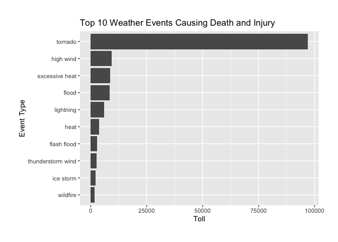
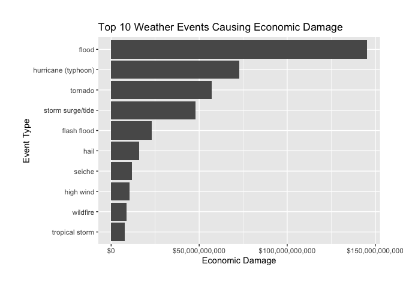

## Synopsis

### The Dataset
This project explores [the U.S. National Oceanic and Atmospheric Administration's (NOAA) storm database from 1950 to 2011](https://d396qusza40orc.cloudfront.net/repdata%2Fdata%2FStormData.csv.bz2) which tracks characteristics of major storms and weather events in the United States. More detailed information can be found in [National Weather Service Storm Data Documentation](https://d396qusza40orc.cloudfront.net/repdata%2Fpeer2_doc%2Fpd01016005curr.pdf) and [National Climatic Data Center Storm Events FAQ](https://d396qusza40orc.cloudfront.net/repdata%2Fpeer2_doc%2FNCDC%20Storm%20Events-FAQ%20Page.pdf). 

### The Questions

1. Across the United States, which types of events are most harmful with respect to population health? 
2. Across the United States, which types of events have the greatest economic consequences? 

### The Variables Needed for Analysis

* EVTYPE
* FATALITIES
* INJURIES
* PROPDMG
* PRODMGEXP
* CROPDMG
* CROPDMGEXP

## Data Processing

### Load Data and Packages
This step will download the data if necessary. The `evtyp_list`, as its name indicates, is a vector containing the names of 48 weather events and will be used to justify typos in `EVTYPE`.

```r
library(tidyverse)
library(R.utils)
library(stringdist)

if (!file.exists("repdata%2Fdata%2FStormData.csv")) {
        if (!file.exists("repdata%2Fdata%2FStormData.csv.bz2")) {
                download.file(url = "https://d396qusza40orc.cloudfront.net/repdata%2Fdata%2FStormData.csv.bz2",
                              destfile = "repdata%2Fdata%2FStormData.csv.bz2", method = "curl")
        }
        bunzip2("repdata%2Fdata%2FStormData.csv.bz2", remove = FALSE)
}

storm <- read_csv("repdata%2Fdata%2FStormData.csv")
evtype_list <- read_table("evtype.txt", col_names = FALSE)[[1]]
```

### Subset
Select the 7 needed variables mentioned before.

```r
storm <- select(storm, EVTYPE, FATALITIES, INJURIES, PROPDMG, PROPDMGEXP, CROPDMG, CROPDMGEXP)
```
The new `storm` dataset looks like:

```r
storm
```

```
## # A tibble: 902,297 x 7
##    EVTYPE  FATALITIES INJURIES PROPDMG PROPDMGEXP CROPDMG CROPDMGEXP
##    <chr>        <dbl>    <dbl>   <dbl> <chr>        <dbl> <lgl>     
##  1 TORNADO          0       15    25   K                0 NA        
##  2 TORNADO          0        0     2.5 K                0 NA        
##  3 TORNADO          0        2    25   K                0 NA        
##  4 TORNADO          0        2     2.5 K                0 NA        
##  5 TORNADO          0        2     2.5 K                0 NA        
##  6 TORNADO          0        6     2.5 K                0 NA        
##  7 TORNADO          0        1     2.5 K                0 NA        
##  8 TORNADO          0        0     2.5 K                0 NA        
##  9 TORNADO          1       14    25   K                0 NA        
## 10 TORNADO          0        0    25   K                0 NA        
## # … with 902,287 more rows
```

### Clean
1. Make variable names and `evtype_list` to lower case.

```r
storm <- mutate(storm, EVTYPE = tolower(EVTYPE))
evtype_list <- tolower(evtype_list)
names(storm) <- tolower(names(storm))
```

2. There are many typos in `evtype` and other events causing more than 48 unique events recorded(nearly a thousand).

```r
as_tibble(unique(storm$evtype))
```

```
## # A tibble: 890 x 1
##    value                    
##    <chr>                    
##  1 tornado                  
##  2 tstm wind                
##  3 hail                     
##  4 freezing rain            
##  5 snow                     
##  6 ice storm/flash flood    
##  7 snow/ice                 
##  8 winter storm             
##  9 hurricane opal/high winds
## 10 thunderstorm winds       
## # … with 880 more rows
```
`stringdist` package provides `amatch()` function for Approximate String Matching. `evtype_list` is the lookup table for matching. However, some elements that still cannot be matched, such as "summary of June", will return NAs. The strategy for these NAs is to use `drop_na()` to drop rows of `evtype` containing NA.


```r
storm$evtype <- evtype_list[amatch(storm$evtype, evtype_list, maxDist = 8)]
storm <- drop_na(storm, evtype)
```
After matching, the unique event numver in `evtype` is perfectly 48.

```r
unique(storm$evtype)
```

```
##  [1] "tornado"                  "high wind"               
##  [3] "hail"                     "freezing fog"            
##  [5] "flood"                    "seiche"                  
##  [7] "winter storm"             "thunderstorm wind"       
##  [9] "debris flow"              "hurricane (typhoon)"     
## [11] "heavy rain"               "lightning"               
## [13] "dense fog"                "rip current"             
## [15] "flash flood"              "funnel cloud"            
## [17] "heat"                     "waterspout"              
## [19] "blizzard"                 "winter weather"          
## [21] "cold/wind chill"          "heavy snow"              
## [23] "sleet"                    "coastal flood"           
## [25] "ice storm"                "avalanche"               
## [27] "marine hail"              "high surf"               
## [29] "excessive heat"           "wildfire"                
## [31] "dust storm"               "dust devil"              
## [33] "strong wind"              "marine thunderstorm wind"
## [35] "drought"                  "storm surge/tide"        
## [37] "tropical storm"           "extreme cold/wind chill" 
## [39] "lake-effect snow"         "frost/freeze"            
## [41] "dense smoke"              "tsunami"                 
## [43] "volcanic ash"             "tropical depression"     
## [45] "marine high wind"         "astronomical low tide"   
## [47] "lakeshore flood"          "marine strong wind"
```

3. Replace characters in `propdmgexp` and `cropdmgexp` with corresponding exponent values.  

B or b = Billion, M or m = Million, K or k = Thousand, H or h = Hundred. The number from one to ten represent the power of ten (10^The number). The symbols "-", "+" and "?" refers to less than, greater than and low certainty. 


```r
storm$propdmgexp <- gsub("[Hh]", "2", storm$propdmgexp)
storm$propdmgexp <- gsub("[Kk]", "3", storm$propdmgexp)
storm$propdmgexp <- gsub("[Mm]", "6", storm$propdmgexp)
storm$propdmgexp <- gsub("[Bb]", "9", storm$propdmgexp)
storm$propdmgexp <- gsub("\\+", "1", storm$propdmgexp)
storm$propdmgexp <- gsub("\\?|\\-|\\ ", "0", storm$propdmgexp)

storm$cropdmgexp <- gsub("[Hh]", "2", storm$cropdmgexp)
storm$cropdmgexp <- gsub("[Kk]", "3", storm$cropdmgexp)
storm$cropdmgexp <- gsub("[Mm]", "6", storm$cropdmgexp)
storm$cropdmgexp <- gsub("[Bb]", "9", storm$cropdmgexp)
storm$cropdmgexp <- gsub("\\+", "1", storm$cropdmgexp)
storm$cropdmgexp <- gsub("\\?|\\-|\\ ", "0", storm$cropdmgexp)

storm$propdmgexp <- as.numeric(storm$propdmgexp)
storm$cropdmgexp <- as.numeric(storm$cropdmgexp)
```

```
## Warning: NAs introduced by coercion
```

```r
storm$propdmgexp[is.na(storm$propdmgexp)] <- 0
storm$cropdmgexp[is.na(storm$cropdmgexp)] <- 0
```

## Analysis

### Impact on Population Health
A new variable called `toll`, which equals to `fatalities` plus `injuries` grouped by `evtype`, can be introduced to illustrate impact on population health.

```r
storm_to_health <- storm %>%
        select(evtype, fatalities, injuries) %>%
        group_by(evtype) %>%
        summarise(toll = sum(fatalities + injuries)) %>%
        arrange(desc(toll))
```

```
## `summarise()` ungrouping output (override with `.groups` argument)
```

```r
knitr::kable(storm_to_health, format = "markdown")
```


|evtype                   |  toll|
|:------------------------|-----:|
|tornado                  | 96997|
|high wind                |  9263|
|excessive heat           |  8723|
|flood                    |  8528|
|lightning                |  6051|
|heat                     |  3649|
|flash flood              |  2838|
|thunderstorm wind        |  2653|
|ice storm                |  2118|
|wildfire                 |  1824|
|winter storm             |  1632|
|hail                     |  1377|
|hurricane (typhoon)      |  1348|
|heavy snow               |  1249|
|rip current              |  1101|
|blizzard                 |   906|
|winter weather           |   606|
|dust storm               |   462|
|tropical storm           |   449|
|avalanche                |   420|
|strong wind              |   412|
|funnel cloud             |   396|
|dense fog                |   361|
|heavy rain               |   355|
|high surf                |   317|
|seiche                   |   256|
|extreme cold/wind chill  |   171|
|tsunami                  |   162|
|marine hail              |   126|
|cold/wind chill          |   108|
|waterspout               |    78|
|storm surge/tide         |    67|
|freezing fog             |    49|
|dust devil               |    45|
|marine strong wind       |    36|
|marine thunderstorm wind |    36|
|marine high wind         |    19|
|drought                  |    18|
|coastal flood            |    15|
|sleet                    |     6|
|debris flow              |     1|
|astronomical low tide    |     0|
|dense smoke              |     0|
|frost/freeze             |     0|
|lake-effect snow         |     0|
|lakeshore flood          |     0|
|tropical depression      |     0|
|volcanic ash             |     0|


### Impact on Economy
Similarly, economic impact can be evaluated by sum of `propdmg` and `cropdmg`. 

```r
storm_to_economy <- storm %>% 
        select(evtype, propdmg, propdmgexp, cropdmg, cropdmgexp) %>%
        mutate(propdmg_num = propdmg * (10 ^ propdmgexp), 
               cropdmg_num = cropdmg * (10 ^ cropdmgexp)) %>%
        group_by(evtype) %>%
        summarise(total_damage = sum(propdmg_num + cropdmg_num)) %>%
        arrange(desc(total_damage))
```

```
## `summarise()` ungrouping output (override with `.groups` argument)
```

```r
knitr::kable(storm_to_economy, format = "markdown")
```


|evtype                   | total_damage|
|:------------------------|------------:|
|flood                    | 145413852011|
|hurricane (typhoon)      |  72737290963|
|tornado                  |  56952354995|
|storm surge/tide         |  47964924855|
|flash flood              |  22950620997|
|hail                     |  15742425499|
|seiche                   |  11883573850|
|high wind                |  10486947014|
|wildfire                 |   8816290696|
|tropical storm           |   7714397015|
|winter storm             |   6689012230|
|thunderstorm wind        |   5433365040|
|ice storm                |   4187487749|
|drought                  |   1046221899|
|heavy snow               |    947869816|
|lightning                |    937906010|
|heavy rain               |    718449836|
|blizzard                 |    659314122|
|coastal flood            |    393866321|
|strong wind              |    181175862|
|tsunami                  |    144112020|
|marine hail              |     94465589|
|high surf                |     90750500|
|funnel cloud             |     67938141|
|waterspout               |     60736200|
|debris flow              |     56000042|
|lake-effect snow         |     40362000|
|winter weather           |     27298015|
|frost/freeze             |     15987647|
|heat                     |     13316502|
|freezing fog             |     10548500|
|excessive heat           |      9804347|
|dense fog                |      9774000|
|astronomical low tide    |      9745000|
|extreme cold/wind chill  |      9453067|
|lakeshore flood          |      7540000|
|marine high wind         |      6718010|
|dust storm               |      6150702|
|avalanche                |      3721805|
|cold/wind chill          |      1990600|
|sleet                    |      1760931|
|tropical depression      |      1737000|
|dust devil               |       738630|
|marine thunderstorm wind |       621479|
|volcanic ash             |       500000|
|marine strong wind       |       418330|
|rip current              |       163000|
|dense smoke              |       100050|


## Results

According to the two tables above the weather events causing the most population health impact is "tornado", and "flood" the most economic impact.

In addition, the top 10 weather events causing population health and economic impact are: 

```r
ggplot(storm_to_health[1:10,], aes(reorder(evtype, toll), toll)) +
        geom_bar(stat = "identity") +
        coord_flip() +
        theme(plot.margin = unit(rep(2,4), "lines")) + 
        labs(title = "Top 10 Weather Events Causing Death and Injury") +
        labs(x = "Event Type", y = "Toll")
```

<!-- -->


```r
ggplot(storm_to_economy[1:10,], aes(reorder(evtype, total_damage), total_damage)) +
        geom_bar(stat = "identity") +
        coord_flip() +
        scale_y_continuous(labels = scales::dollar) +
        theme(plot.margin = unit(rep(2,4), "lines")) + 
        labs(title = "Top 10 Weather Events Causing Economic Damage") +
        labs(x = "Event Type", y = "Economic Damage")
```

<!-- -->


